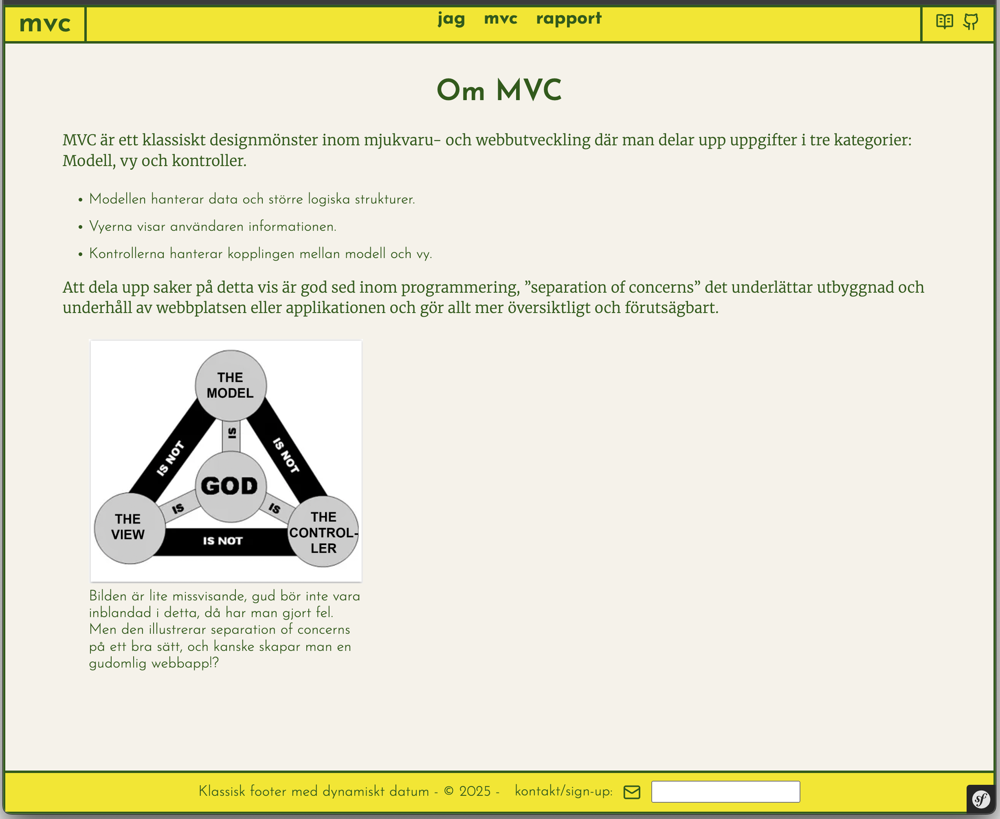

# MVC

This is a work in progress, to clone or contribute follow these guidelines.



___

## How it's made
This is what I have used and could be seen as a minimum requirement if you don't know otherwise.

___

### Project technologies

- PHP 8.3
- Composer 2.8.2
- Symfony 7.2.4
- NPM 10.9.0

___

### Clone the repo
```
git clone https://github.com/SIMON-5000/mvc.git
```
```
cd mvc
```

#### Install

```
composer install
npm install
npm run build
```

#### Run

```
php -S localhost:8888 -t public
```

OR

If you prefer to install the Symfony CLI:

<details><summary>Bash Windows WSL / Linux</summary>

```bash
curl -1sLf 'https://dl.cloudsmith.io/public/symfony/stable/setup.deb.sh' | sudo -E bash
sudo apt install symfony-cli
```

</details>

<details><summary>macOS</summary>

```bash
brew install symfony-cli/tap/symfony-cli
```

</details>

Then we can start the Symfony local web server, like this:

```bash
symfony server:start
```


___

### API-KEY
I hid my API-key for the random-weather service, but you can get your own at:
https://weatherstack.com/signup/free
and create the file public/data/API_KEY.php
```php
$key = '<Paste your key here>';
```

Live demo: https://www.student.bth.se/~sidr24/dbwebb-kurser/mvc/me/report/public

